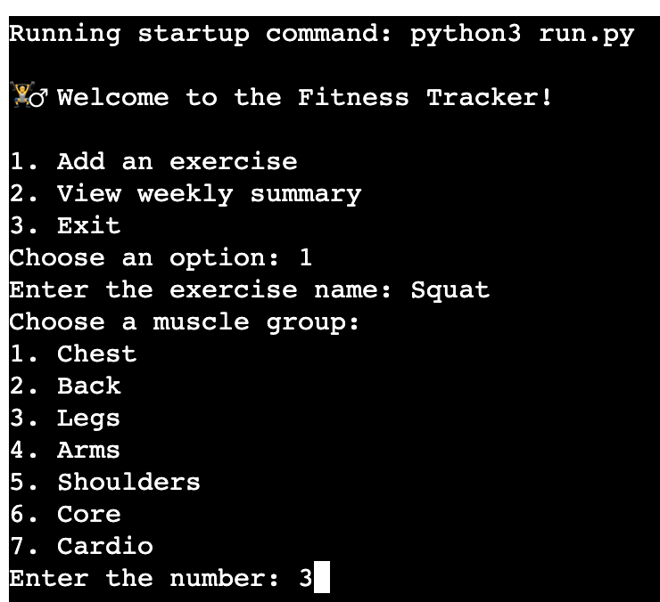

# Introduction 

FitnessTracker is a command-line Python application designed to help users track their fitness exercises and store data in Google Sheets. This allows users to monitor their progress over time effectively.

The application is ideal for individuals who want to record their weekly fitness journey, including:

- The exercises performed
- The number of repetitions per set
- The weight used

By providing a clear record of these details, FitnessTracker encourages the progressive overload technique, helping users steadily increase their performance and achieve their fitness goals by tracking their progress based on weights and repetitions.

# User Stories 

**1. Exercise logging**

- As a user, I want to input my daily exercises and enter the name of the exercise to record my workout.

- As a user, I want to specify the muscle group worked for an exercise to ensure I split my workout accordingly for a more complete physique.

- As a user, I want to record the number of sets and reps I complete so that I can monitor improvements over time.

- As a user, I want to log the weights used for each exercise (if applicable) so that I can track strength gains.

**3. Progress tracking**

- As a user, I want to view my fitness progress over time.

- As a user, I want to view the data for exercises completed, the number of reps per set, and the weight used.

**2. Account management**

- As a first-time user, I want clear instructions on how to use the program so that I can start logging exercises easily.

- As a user, I want the option to exit the program at any time and return later.

# Features 

## Main Menu

Users are greeted with a welcome message and shown three options:

1. Add an exercise
2. View weekly summary
3. Exit the program

## Option 1: Add an exercise 

Users can enter the name of the exercise they wish to log.

Users can categorise the exercise by selecting one of seven predefined muscle groups (including cardio for whole-body exercises). 

Users can input the number of sets and reps performed.

Then users can input the number of reps they have done for each set 

Users can log the weight (kg) used (if applicable).

## Saved Exercise 

Once all data is entered, a summary is displayed for user confirmation before saving to Google Sheets.

## Google Sheets

All logged exercises are saved to a Google Sheets spreadsheet, along with the date recorded. This feature allows users to monitor their progress over time in an easily accessible format.

## Option 2: View weekly summary 

If the user selects option 2 then a total weekly summary of all completed reps and weight is shown for each muscle group. This helps the user track their strength over time to see if they are stronger and encourage a progressive overload workout

If the user selects option 2 total reps and weights for each muscle group will be displayed. This helps users track progress and identify areas for improvement.

## Option 3: Exit

If the user selects option 3 then they can end the program with a goodbye message displayed

## Error handling 

• Ensures users cannot proceed with invalid inputs.

• Displays clear error messages to guide users back on track.

Input validation ensures that users only proceed with valid choices (1, 2, or 3). If invalid the terminal displays an error message and returns the user to the main menu.

If the user inputs anything other than the values 1 - 7, an invalid choice message appears letting the user know to chose between the provided options.

If a string value is inputed the user is told to try again

If a string value is inputed the user is told to try again

If a string value is inputed the user is told to try again

# Flowchart

The planning of this Fitness Tracker was based on the flowchart below.

# Testing 

## Validator Testing

• The python code deployed on Heroku was run through Code Institute's PEP8 linter, with no major issues found.

• The only warning was that the credentials.json keyfile on line 22 was too long, which was expected.

[CI PEP8 Linter](https://pep8ci.herokuapp.com/)

## User Testing

All feautures were tested manually to check if users were able to successfully log exercises, including the muscle group worked, sets/reps, and weight used. 

1. Correct Inputs

    • Verified that the app logs exercises accurately, including muscle group, sets/reps, and weights.

2. Invalid Inputs

    • Confirmed that invalid inputs (e.g., text instead of numbers) trigger error messages and require re-entry.

3. Weekly Summary

    • Verified that the weekly summary displays data correctly (correct totals, no errors in weight calculation), although it currently shows total data
    instead of a true weekly breakdown.

4. Flow and Navigation

    • Confirmed users can navigate the main menu and exit the program without issues.

### Areas for improvement ###

1. Users cannot go back to previous steps to correct incorrect inputs, meaning they must restart the program to fix mistakes.

2. The weekly summary displays a total summary rather than a breakdown by week. This could be improved in future updates.

3. The calculation for total weight used per muscle group is not entirely accurate. It would be better to display the highest weight used or find another method to track progress more effectively.

4. Consider adding colour-coded output for better user experience and readability.

These improvements are areas for future development and refinement.

# Deployment

### Heroku ###

This project was deployed using Code Institute's template for Heroku.

Steps to deploy:

1. Create a Heroku account and click "New" then "Create new app."
2. Name the new app and click "Create new app."
3. In the "Settings" tab, select "BuildPack" and choose Python and Node.js (Python must be at the top of the list).
4. While still in "Settings," click "Reveal Config Vars" and add the content from the credentials.json file as needed for Google Sheets API access.
5. Click on the "Deploy" tab and select your deployment method, then search for your repository name.
6. Click "Connect to GitHub" on the selected repository.
7. Choose either "Enable Automatic Deploys" for continuous deployment or "Deploy Branch" for manual deployment.

Heroku will now deploy the app, and it will be accessible from the provided URL.

# Bugs

• No major bugs were encountered during development.

• Issue: Difficulty getting Heroku to read the credentials.json file.
    Fix: Set the environment variables in Heroku using config vars, updated the setup_google_sheet function to include os.environ, and imported the os library.

# Technologies Used 

### Languages: 

• Python 3.12.2

### Version Control & Deployment 

• Git 

• Github

• Heroku

### Diagram Tools 

• [Lucidchart](https://www.lucidchart.com/pages/lucidchart-vs-visio?utm_source=google&utm_medium=cpc&utm_campaign=_chart_en_us-tier1_desktop_search_competitor-vzo_exact_&km_CPC_CampaignId=19828951112&km_CPC_AdGroupID=150042488834&km_CPC_Keyword=visio&km_CPC_MatchType=e&km_CPC_ExtensionID=&km_CPC_Network=g&km_CPC_AdPosition=&km_CPC_Creative=666012071422&km_CPC_TargetID=kwd-12562710&km_CPC_Country=9045954&km_CPC_Device=c&km_CPC_placement=&km_CPC_target=&gad_source=1&gclid=CjwKCAiA7Y28BhAnEiwAAdOJUGxokcp54PF5kOWcSKnKQiVgb7BDkvCFszwS4C5PPMYc71guexnYqhoCvHAQAvD_BwE)

### Libraries 

• Google Sheets

• Google Sheets API

• gspread Python library

• google-auth Python library
